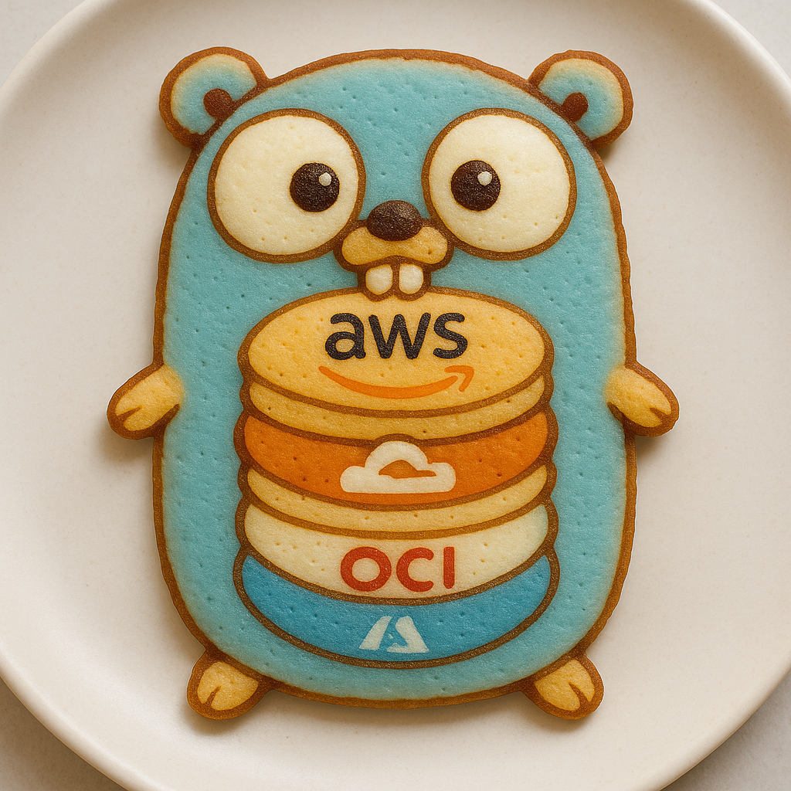

---

## ☁️ Pancake Stack (Cloud Layers)

>   
> _The official mascot of Cloud Pancake, featuring our Go-powered multi-cloud stack._

The project models a layered stack of cloud providers:

1. 🟨 **AWS** – Top layer
2. 🔴 **GCP**
3. 🔵 **OCI**
4. 🟪 **Azure** – Base layer

Each provider layer simulates a functional slice of infrastructure, with room to expand into real multi-cloud deployments.

---

## 🛠️ Technologies Used

- **Go** – Backend language for handling logic
- **Terraform** – Infrastructure provisioning
- **Jenkins** – CI/CD automation
- **Cloud Providers** – AWS, GCP, OCI, Azure

---
